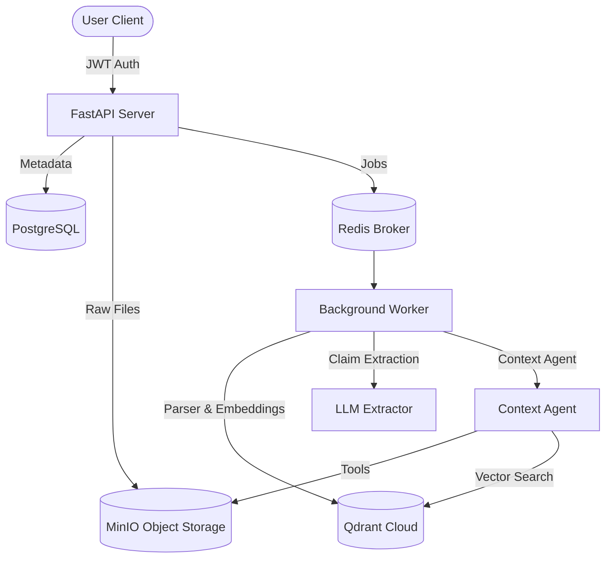

# Evidentia

Evidentia is an enterprise document analysis, claim extraction, and agentic context-building platform. It automates the extraction of factual claims from complex documents, enriches structural layout elements, and constructs claim context using vector similarity search and AI agent tools.

---

## Key Features

- **Multi-Tenant Workspace Isolation**: Scopes all documents, analyses, vectors, and storage assets to a `workspace_id`.
- **Deterministic and Enriched Indexing**: Parses document structural elements (headings, paragraphs, lists, tables) deterministically without LLM overhead, followed by selective LLM enrichment for glossaries and visual captions.
- **Claim Extraction Pipeline**: Single-pass and chunked map-reduce claim extraction pipelines featuring overlap reconciliation and coverage checking.
- **Agentic Context Building**: Orchestrates context agents using custom tools (`get_section`, `get_page`, `search_document`, `get_visual`, `get_glossary_term`).
- **Distributed Storage**: Integrates PostgreSQL (Relational metadata), MinIO (S3 Object Storage), and Qdrant (Vector Similarity Search).
- **Execution Tracing and Auditing**: Structured execution logging, tool call tracking, and model pricing calculations.

---

## Technology Stack

| Layer | Technology |
| :--- | :--- |
| **API Framework** | FastAPI (Python 3.11+) |
| **Relational Database** | PostgreSQL 16 + Async SQLAlchemy 2.0 |
| **Database Migrations**| Alembic |
| **Vector Database** | Qdrant Cloud / Local Container |
| **Object Storage** | MinIO (S3 Compatible) |
| **Task Queue** | Celery + Redis |
| **LLM Providers** | OpenAI Agents SDK & Google Gemini API |

---

## System Architecture



---

## Local Development Setup

### 1. Prerequisites
- Python 3.11+
- Docker Desktop

### 2. Environment Setup
Clone the repository and set up a Python virtual environment:

```powershell
python -m venv .venv
.\.venv\Scripts\activate
pip install -r requirements.txt
```

### 3. Environment Variables
Copy `.env.example` to `.env` and configure your credentials:

```powershell
cp .env.example .env
```

Ensure `.env` contains your PostgreSQL, MinIO, Qdrant, and LLM provider keys.

### 4. Infrastructure Services
Start PostgreSQL, Redis, MinIO, and Qdrant using Docker Compose:

```powershell
docker compose up -d
```

### 5. Database Migrations
Apply Alembic migrations to create the database tables:

```powershell
python -m alembic upgrade head
```

---

## Verification and Testing

To verify MinIO bucket initialization, JSON storage round-trips, and Qdrant vector similarity queries, run:

```powershell
python -m scratch.test_storage
```

---

## Directory Layout

```
evidentia/
├── alembic.ini                  # Alembic configuration
├── docker-compose.yml           # Docker services (Postgres, Redis, MinIO, Qdrant)
├── requirements.txt             # Python dependencies
├── .env.example                 # Environment variables template
├── plan.md                      # Phase 1 project plan
├── design.md                    # System design and database specifications
├── task.md                      # Development roadmap and task tracker
├── migrations/                  # Alembic migration revisions
├── app/
│   ├── main.py                  # FastAPI application entrypoint
│   ├── core/                    # Configuration and security settings
│   ├── db/                      # SQLAlchemy models and database sessions
│   └── storage/                 # MinIO and Qdrant client wrappers
└── scratch/                     # Test and verification scripts
```
